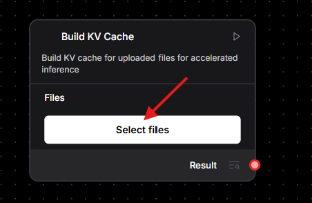
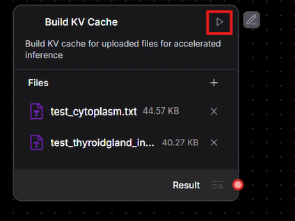
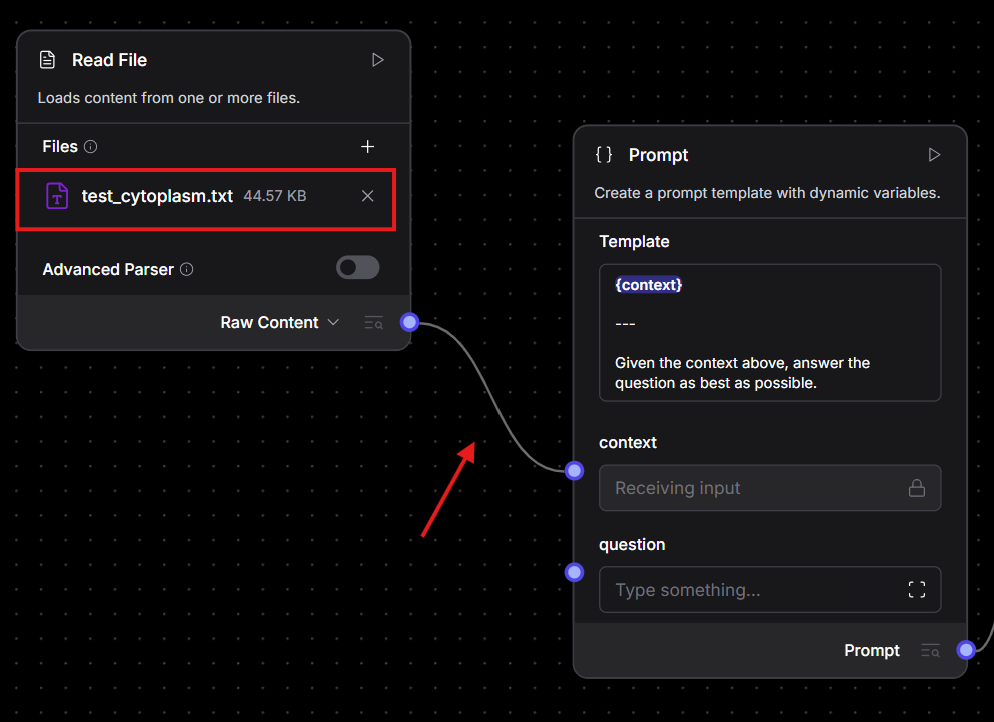

# aiDAPTIV Langflow User Guide 
## Overview 
This guide explains how to install, configure, and use Langflow integrated with aiDAPTIV. It also covers how to run the default Vector RAG flow, test KV-cache-accelerated inference using golden examples, and understand the system’s startup behaviors.

## Chapter 1: Installation and Setting
### Installation Steps
#### Prerequisites
1. Ensure the aiDAPTIV server is running and available at `http://localhost:13141/v1`

#### Setup
1. Navigate to the **installer** directory
2. Install the `aiDAPTIV_Langflow_Installer.exe`
3. Launch the application by double clicking `aiDAPTIV Langflow.exe`. This will open a terminal window where the system automatically starts Langflow..

## Chapter 2: How to Use?
### Usage Workflow
1. **Initial Setup**
- Wait until the terminal shows the message:
`Application started`.
Once this appears, Langflow’s web interface will open automatically in your browser.
2. **Basic Operation**
- **Accessing the Default Flow**: 
    - A preconfigured flow named `KV cache Generation` will appear on the Langflow webpage.
    - Click on `KV cache Generation` to access the flow.

- **Step-by-step instruction**:
    - There are two flows in the `KV Cache Generation`.
    - Run `Build KV Cache` flow to enhance the inference speed when conducting Q&A with your documents.
    - Run `Q&A` flow when you're ready to chat with your assistant.

- **Using Example Files (Golden Workflow for KV Cache)**
    - Before running any components, please ensure that all required fields (e.g., `OpenAI API Key` and `OpenAI API Base`) are filled in correctly.
      - The `OpenAI API Key` can be set to `EMPTY` (You can provide a valid API key from your cloud provider if there's any)
      - The `OpenAI API Base` should be set to `http://localhost:13141/v1` (for aiDAPTIV).
    - Start by building KV cache to enhance the inference speed. (This may take a few minutes to process large documents). This can be done in `Build KV Cache` flow.
        - Two golden example files have already been uploaded in the File node
            1. `test_cytoplasm.txt`
            2. `test_thyroidgland_insulin.txt`
        - To experience fast inference using KV cache reuse, first click the `select` icon in the `KV cache build` component to choose the files you want to process. By default, the two golden example files will appear in the UI when you click `select`. Tick to select them. 
        - Click the `Run` button of the component to build the KV cache. 
    - You may start chatting with your assistant at accelerated speed using the `Q&A` flow. 
        - First, select the document you want to query by clicking the `Read File` component, then drag a connection from `Read File` component to the `context` field of the `Prompt` component. 
        - Then click the `Playground` icon (**top-right** corner) to enter the interactive chat interface. 
